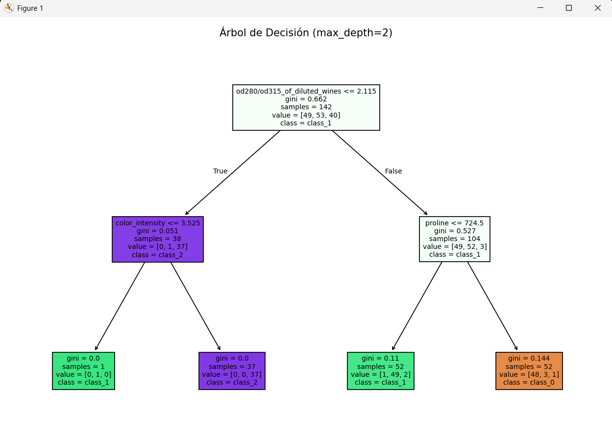
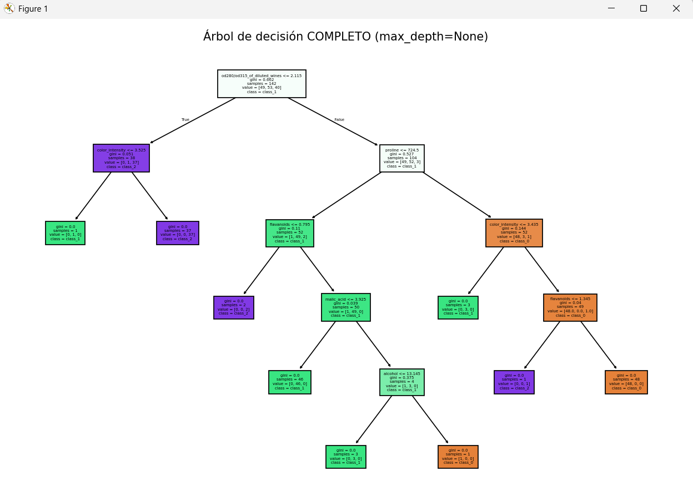

# **Clasificación con Árbol de Decisión — Wine Dataset**

Este proyecto implementa un modelo de **Clasificación con Árbol de Decisión** utilizando el dataset *Wine* incluido en Scikit-Learn.
El objetivo es entrenar un modelo de clasificación, visualizar sus reglas y evaluar su precisión.
Se desarrolló el código siguiendo exactamente los pasos solicitados en la actividad.


##  **Resultados del modelo**

### **1. Precisión con `max_depth = 2`**

```
Precisión: 0.9166
```

### **Reglas generadas con profundidad limitada**

```
|--- od280/od315_of_diluted_wines <= 2.11
|   |--- color_intensity <= 3.52
|   |   |--- class: 1
|   |--- color_intensity >  3.52
|   |   |--- class: 2
|--- od280/od315_of_diluted_wines >  2.11
|   |--- proline <= 724.50
|   |   |--- class: 1
|   |--- proline >  724.50
|   |   |--- class: 0
```
### **Explicación en español de lo que significa este árbol**

Este árbol es pequeño y utiliza únicamente **tres características químicas** para clasificar los vinos:

* **od280/od315_of_diluted_wines** (relacionado con calidad y composición del vino)
* **color_intensity**
* **proline** (aminoácido)

El árbol funciona así:

* **Primera pregunta:**
  *¿El valor od280/od315 es menor o igual a 2.11?*

* Si **sí**, mira la intensidad de color:

  * baja → **clase 1**
  * alta → **clase 2**

* Si **no**, mira el valor de proline:

  * bajo → **clase 1**
  * alto → **clase 0**

Con solo estas reglas simples, el modelo logra **91.66% de precisión**, lo cual significa que clasifica correctamente casi 9 de cada 10 vinos.

Este árbol es **muy interpretable, limpio y eficiente**.

### **Resultado del arbol Grafico**


---

### **2. Precisión con `max_depth = None` (sin límite)**

```
Precisión: 0.9166
```

### **Reglas generadas con profundidad completa**

```
|--- od280/od315_of_diluted_wines <= 2.11
|   |--- color_intensity <= 3.52
|   |   |--- class: 1
|   |--- color_intensity >  3.52
|   |   |--- class: 2
|--- od280/od315_of_diluted_wines >  2.11
|   |--- proline <= 724.50
|   |   |--- flavanoids <= 0.80
|   |   |   |--- class: 2
|   |   |--- flavanoids >  0.80
|   |   |   |--- malic_acid <= 3.92
|   |   |   |   |--- class: 1
|   |   |   |--- malic_acid >  3.92
|   |   |   |   |--- total_phenols <= 2.63
|   |   |   |   |   |--- class: 1
|   |   |   |   |--- total_phenols >  2.63
|   |   |   |   |   |--- class: 0
|   |--- proline >  724.50
|   |   |--- color_intensity <= 3.43
|   |   |   |--- class: 1
|   |   |--- color_intensity >  3.43
|   |   |   |--- total_phenols <= 1.80
|   |   |   |   |--- class: 2
|   |   |   |--- total_phenols >  1.80
|   |   |   |   |--- class: 0
```
##  **Explicación de este árbol profundo**

El árbol sin límite utiliza **muchas más características**:

* flavanoids
* malic_acid
* total_phenols
* color_intensity
* proline
* od280/od315

Esto permite que el árbol “memorice” más detalles del dataset, pero:

➡️ **No mejora la precisión**
➡️ Produce reglas más largas y difíciles de interpretar
➡️ Corre el riesgo de sobreajuste (*overfitting*)

En simples palabras:

> El árbol sin límites sabe más cosas, pero no clasifica mejor.
> El dataset Wine se separa muy bien con muy pocas reglas.


### **Resultado del arbol Grafico (sin profundidad version resumida)**


### **Resultado del arbol Grafico (sin profundidad)**

---

## **Opiniones sobre los resultados**

Los resultados muestran que:

* Tanto el árbol limitado (`max_depth=2`) como el árbol completo (`max_depth=None`) obtienen **la misma precisión: 91.66%**.
* El árbol con profundidad limitada es **más simple, interpretable y limpio**, por lo que es mejor para explicar decisiones.
* El árbol sin límite genera **más reglas y más niveles**, lo que permite separar más fino los datos, pero puede generar **sobreajuste (overfitting)**.
* A pesar de que el árbol completo tiene más reglas, **no mejora la precisión**; esto indica que el dataset Wine ya es muy separable incluso con pocas reglas.

#### En conclusión, un árbol pequeño funciona perfectamente para este dataset.

---

##  **¿La base de conocimiento FoodLab sirve para un Árbol de Decisión?**

FoodLab incluye categorías como:

* **Carbohidratos**
* **Lácteos**
* **Proteína animal**
* **Proteína vegetal**
* **Verduras**
* **Chiles por picor**
* **Recetas por tiempo**

---

#### **Respuesta:** **Sí, En mi opinion FoodLab sí cumple con los requisitos para usarse en un Árbol de Decisiones.**

---

## **Justificación**

Un árbol de decisión funciona cuando:

1. **Hay categorías claramente definidas** (clases).
2. **Las entradas pueden representarse como atributos o características.**
3. **Las decisiones pueden dividirse en reglas tipo “sí/no”**.

FoodLab cumple con todo esto porque:

* Tiene **clases**:

  * Por tipo de alimento
  * Por picor
  * Por tiempo de preparación
* Tiene **características claras**:

  * Tipo de ingrediente
  * Tiempo
  * Nivel de picor
* Se pueden generar **reglas lógicas**, por ejemplo:

  * *"Si el tiempo <= 30 min → receta rápida"*
  * *"Si es chile y su picor > 7 → muy picante"*
  * *"Si el ingrediente es carne → proteína animal"*

Por lo tanto, **un árbol de decisión sí puede clasificar nuestras recetas**.


### **Características posibles del modelo**

Un modelo basado en FoodLab podría tener características como:

### Para clasificar ingredientes:

* tipo_de_alimento (carbohidrato, proteína, vegetal, chile)
* nivel_picante (0 = no, 1 = poco, 2 = medio, 3 = alto)
* es_animal / es_vegetal
* tiempo_de_cocción_estimado
* categoría_nutricional

### Para clasificar recetas:

* tiempo_de_preparación
* nivel_de_picor
* tipo_de_proteína


### **Clases posibles**

### Para ingredientes:

* carbohidrato
* lácteo
* proteína animal
* proteína vegetal
* verdura
* chile (clasificado por picor)

### Para recetas:

* rápidas (≤30 min)
* moderadas (31–50 min)
* largas (>50 min)
* picantes / no picantes


Estas clases se pueden clasificar perfectamente con un árbol.


##  **Conclusión final**

FoodLab **sí puede usarse para un modelo de Árbol de Decisión**, porque los datos:

* Son clasificados
* Son medibles
* Son estructurados
* Son fáciles de dividir en reglas

Por lo tanto, FoodLab es un excelente candidato para:

* Clasificar ingredientes
* Clasificar recetas
* Predecir tiempos
* Predecir niveles de picor
